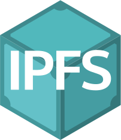
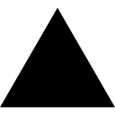

# 👋 Hello There

I’m Mayank Ravariya, currently pursuing B.Tech in CSE-AIML 🎓 from Sadar Patel Institute of Technology 🏛. I have a passion for exploring new technologies and applying them to solve real-life problems ✨. I'm currently working on my Web Development Skills 🕸️.

<!-- 
 -->

 

## ⚡️ Tech Stack

**👨‍💻 Programming Languages**

<code></code>
<code></code>
<code></code>
<code></code>
<code></code>
<code></code>
<code></code>
<code></code>
<code></code>

 

**🧰 Frameworks & Libraries**

<code></code>
<code></code>
<code></code>
<code></code>
<code></code>
<code></code>
<code></code>
<code></code>
<code></code>
<code></code>
<code></code>
<code></code>

 

**☁️🗄️ Cloud hosting & Database**

<code></code>
<code></code>
<code></code>
<code></code>
<code></code>
<code></code>

 

**⚙️ Softwares, Tools & Environment**

<code></code>
<code></code>
<code></code>
<code></code>
<code></code>
<code></code>
<code></code>
<code></code>
<code></code>
<code></code>
<code></code>
<code></code>

 
 

 
 

  <i>A problem can be solved in a 100 different ways and There's always an easier way to solve a problem.</i>
   
  <i>You miss 100% of the shots you don't take.</i>
 

